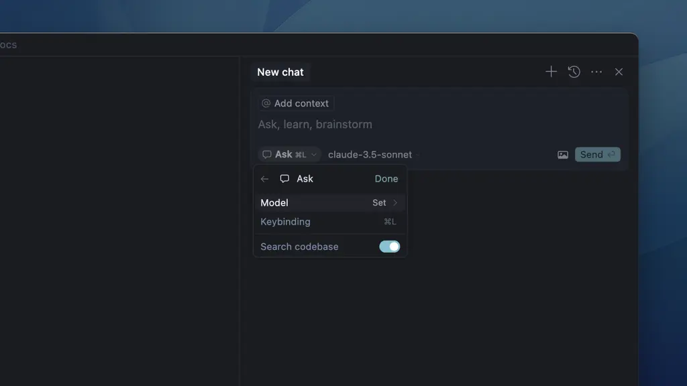

# Exercício 01: Olá, Cursor! (Modo Ask)

**Objetivo:** Ter o primeiro contato com a interface de chat do Cursor e entender o modo Ask.

---

## 📝 Passo a Passo

1.  **Abra o painel de chat** do Cursor (atalho `Cmd + L` no Mac ou `Ctrl + L` no Windows).
2.  Certifique-se de que o modo selecionado é o **Ask** (geralmente é o padrão).
3.  Digite o seguinte prompt na caixa de texto:
    ```text
    "O que você é capaz de fazer?"
    ```
4.  Pressione `Enter` e aguarde a resposta.

---

## 🖼️ Referência Visual



---

## ❓ Dúvidas e Erros Comuns

**Onde fica o chat?**
Se não aparecer com o atalho, procure pelo ícone de balão de fala na barra lateral direita (ou esquerda, dependendo da sua configuração).

**O chat não respondeu**
Verifique sua conexão com a internet. O Cursor precisa estar online para acessar os modelos de IA.

**Qual modelo estou usando?**
Verifique no dropdown dentro da caixa de chat (ex: `claude-3.7-sonnet`, `gpt-4o`).
