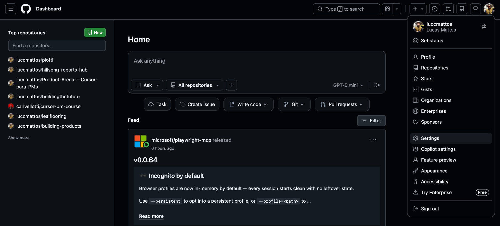
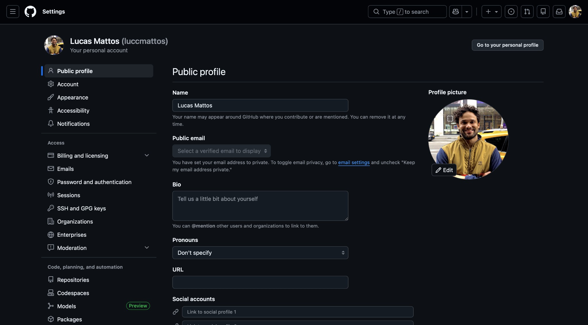
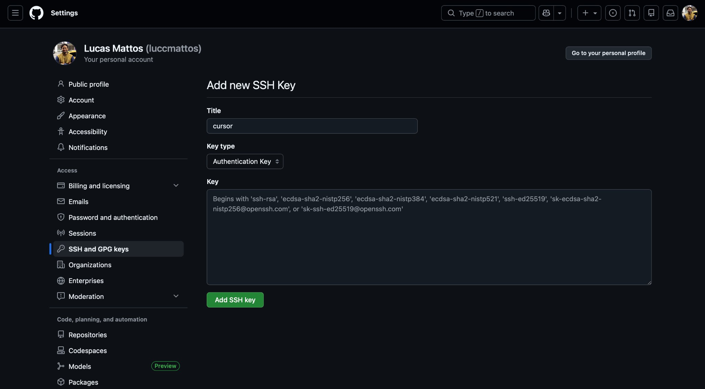

# Exercício 02: Preparando o Terreno (Modo Plan)

**Objetivo:** Usar o raciocínio do Cursor para mapear dependências antes de executar uma ação técnica (Git).

---

## 📝 Passo a Passo

1.  Se você acabou de fazer o Exercício 01 (modo Ask), **troque o modo para `Plan`** agora.
2.  Mude o modo do chat para **Plan** (se disponível) ou apenas inicie seu prompt com a palavra "Plan".
    *   *Nota: O objetivo é fazer o Cursor "pensar" antes de responder. Se não houver um botão específico, basta pedir explicitamente: "Crie um plano detalhado para..."*
    *   **Neste exercício, usaremos o Chat (`Cmd + L`).**
3.  Digite o seguinte prompt:
    ```text
    "Eu já tenho uma conta no GitHub. O que preciso ter instalado ou configurado na minha máquina para clonar um repositório aqui?"
    ```
4.  Leia a resposta. O Cursor deve listar requisitos como Git instalado, chaves SSH configuradas, etc.

---

## 🖼️ Referência visual — configurando chave SSH no GitHub

1. **Dashboard:** entre em `github.com`, faça login e abra o menu do avatar no canto superior direito.
   

2. **Settings:** clique em **Settings** e, no menu lateral, vá em **SSH and GPG keys**.
   

3. **Adicionar chave:** clique em **New SSH key**, dê um título (ex.: `cursor`) e cole a chave pública que o Cursor gerou. Depois clique em **Add SSH key**.
   

---

## ❓ Dúvidas e Erros Comuns

**Erro "xcrun: error: invalid active developer path" (Mac)**
Isso é clássico em Macs novos. Significa que faltam as ferramentas básicas de desenvolvimento (Xcode Command Line Tools).
*Solução:* Peça ao Cursor: "Como instalo o Xcode Command Line Tools?". Geralmente basta rodar `xcode-select --install` no terminal.

**O Cursor sugeriu instalar "Homebrew" (brew)**
Homebrew é um "gerenciador de pacotes" para Mac (pense nele como uma App Store para ferramentas de desenvolvedor). É seguro e muito comum. Se o Cursor sugerir, pode aceitar — ele vai facilitar a instalação do Git.

**Sugeriu usar `gh` em vez de `git`?**
O `gh` (GitHub CLI) é uma ferramenta oficial do GitHub que facilita o login. É uma ótima alternativa às chaves SSH. Se o plano sugerir `gh auth login`, pode seguir que é até mais fácil.

**O Cursor diz que não tenho acesso ao terminal**
Neste passo, ele está apenas listando informações. Se ele tentar rodar comandos e falhar, é porque não demos permissão ainda (veremos no próximo exercício).

**Não entendi o que é SSH**
Pode perguntar de volta no chat: "Me explique o que é SSH como se eu tivesse 10 anos".
